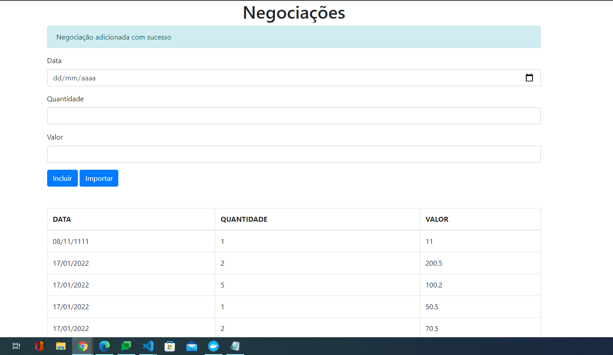

<h1>Typescript Negociation</h1>
<h2>O que é esse projeto?</h2>

Projeto desenvolvido durante formação typescript da Alura

<ol>
  <li>Object-oriented programming</li>
  <li>Generics, Types, Classes</li>
  <li>Models, Views and Controllers</li>
  <li>Decorators</li>
  <li>External API and interface</li>
</ol>
<h2>Tecnologias usadas:</h2>
<ul>
  <li>Typescript</li>
  <li>Node.js</li>
  <li>Bootstrap</li>
</ul>

<h2>Front End:</h2>

  

